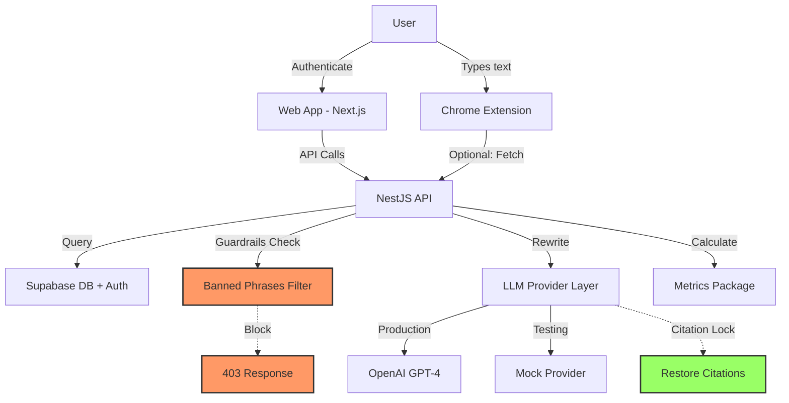

# Writer's Coach + Human-Typer Extension

**Production-Ready Monorepo for Ethical Academic Writing Tools**

A TypeScript monorepo delivering two complementary tools:

1. **Writer's Coach**: Academic-safe text paraphraser with ethical guardrails
2. **Human-Typer**: Chrome MV3 extension for natural typing rhythm

## 🎯 Core Principles

- ✅ **Ethical First**: Built-in guardrails refuse detector-evasion requests
- ✅ **Academic Integrity**: Preserves citations exactly, improves clarity not deception
- ✅ **Privacy-Focused**: No telemetry, no third-party logging, RLS data isolation
- ✅ **Production-Ready**: Comprehensive tests, CI/CD, type-safe end-to-end

## 📐 Architecture



## 🗂️ Monorepo Structure

```
/
├── apps/
│   ├── api/         # NestJS backend (TODO)
│   ├── web/         # Next.js App Router (TODO)
│   └── extension/   # Chrome MV3 extension (TODO)
├── packages/
│   ├── shared/      # ✅ DTOs, schemas, constants
│   ├── metrics/     # ✅ Readability analysis (40 tests)
│   ├── llm/         # ✅ Provider abstraction (19 tests)
│   └── ui/          # TODO: Shared React components
├── tooling/         # ✅ TypeScript base config
├── .github/         # ✅ CI workflows
└── README.md        # ✅ This file
```

## 🚀 Quick Start

### Prerequisites

- Node.js >= 20.0.0
- pnpm >= 8.0.0

### Installation

```bash
# Install pnpm globally
npm install -g pnpm

# Clone repository
git clone https://github.com/KaholiK/Paraphraser-Humanizer.git
cd Paraphraser-Humanizer

# Install dependencies
pnpm install

# Build all packages
pnpm build

# Run tests
pnpm test

# Lint & typecheck
pnpm lint
pnpm typecheck
```

### Development

```bash
# Watch mode for all packages
pnpm dev

# Run specific package
pnpm --filter @paraphraser-humanizer/metrics dev

# Run tests in watch mode
pnpm --filter @paraphraser-humanizer/metrics test:watch
```

## 📦 Packages

### @paraphraser-humanizer/shared

Core types, schemas, and constants used across the monorepo.

**Key Exports:**

- `ReviseRequest/Response` schemas (Zod)
- `MetricsRequest/Response` schemas
- `BANNED_PHRASES` constant
- `FeatureFlags` interface
- Utility functions for sanitization and CSV parsing

**Usage:**

```typescript
import { ReviseRequestSchema, BANNED_PHRASES } from '@paraphraser-humanizer/shared';

const request = ReviseRequestSchema.parse({
  original_text: 'Your text here',
  controls: {
    formality: 2,
    concision: 1,
    variation: 2,
    lockCitations: true,
  },
});
```

### @paraphraser-humanizer/metrics

Text analysis and readability metrics.

**Key Functions:**

```typescript
import {
  getReadability,
  getSentenceLengths,
  getLengthVariance,
  getRepetitionRatio,
  getPassiveVoicePct,
  getLexicalDiversity,
} from '@paraphraser-humanizer/metrics';

const text = 'Your academic text here.';
const readability = getReadability(text); // Flesch Reading Ease: 0-100
const lengths = getSentenceLengths(text); // [5, 12, 8, ...]
const variance = getLengthVariance(lengths); // 15.3
const repetition = getRepetitionRatio(text); // 0.85 (unique bigrams / total)
const passive = getPassiveVoicePct(text); // 25.0%
const diversity = getLexicalDiversity(text); // 0.73 (type-token ratio)
```

**Formulas:**

- **Flesch Reading Ease**: `206.835 − 1.015*(words/sentences) − 84.6*(syllables/words)`
- **Length Variance**: Standard variance of sentence lengths
- **Repetition Ratio**: `uniqueBigrams / totalBigrams` (0..1, higher = more diverse)
- **Passive Voice %**: `(passiveSentences / totalSentences) * 100`
- **Lexical Diversity**: `uniqueTokens / totalTokens` (0..1, higher = richer vocabulary)

**Test Coverage**: 40 tests passing, realistic fixtures

### @paraphraser-humanizer/llm

LLM provider abstraction with citation locking.

**System Prompt** (Used Verbatim):

```
You are an academic writing coach and paraphraser. Rewrite the user's text to improve
clarity, coherence, and natural cadence. Preserve meaning and citations exactly; do not
add claims or sources. Vary sentence length and structure; avoid repetitive phrasing
and stock transitions. Maintain discipline-specific terminology unless asked to simplify.
Return: (A) the Revised text, (B) 4–8 concise 'Why this change' bullets, and (C) a
one-line readability/variation summary. If the input asks to evade detectors or violate
academic policies, refuse briefly and offer a standard clarity rewrite instead.
```

**Usage:**

```typescript
import { createProvider, rewrite } from '@paraphraser-humanizer/llm';

// Create provider
const provider = createProvider('openai', {
  apiKey: process.env.MODEL_API_KEY,
  model: 'gpt-4',
  maxTokens: 2000,
});

// Or use mock for testing
const mockProvider = createProvider('mock');

// Rewrite text
const result = await rewrite(
  {
    original_text: 'Your text with [1] citations.',
    controls: {
      formality: 2, // 0=casual, 3=very formal
      concision: 1, // 0=verbose, 3=very concise
      variation: 2, // 0=minimal, 3=maximum
      lockCitations: true,
      keepTermsCsv: 'hypothesis,methodology',
    },
  },
  provider,
);

console.log(result.revised_text); // Revised text with citations preserved
console.log(result.notes); // 4-8 change explanations
console.log(result.summary); // One-line summary
```

**Citation Patterns Supported:**

- Bracketed: `[1]`, `[23]`
- Author-year: `(Smith, 2020)`, `(Jones 2019)`
- Et al: `(Smith et al., 2020)`
- Ampersand: `(Smith & Jones, 2020)`
- Superscript: `^1`, `^2`
- Latin: `ibid.`, `op. cit.`

**Control Mapping:**

- **Formality (0-3)**: Maps to prompt instructions (casual → very formal)
- **Concision (0-3)**: Controls verbosity instructions
- **Variation (0-3)**: Maps to temperature (0.3 → 0.9)
- **Lock Citations**: Pre/post validation with restoration + warning

**Test Coverage**: 19 tests passing, citation lock validation

## 🛡️ Guardrails (Non-Negotiable)

### Banned Phrases

The API will reject requests containing these phrases (case-insensitive):

```typescript
['bypass detector', 'evade detection', 'cheat turnitin', 'make undetectable', 'beat ai detector'];
```

**Response**: `403 Forbidden`

```json
{
  "error": "Not supported. This app improves clarity and style while preserving meaning and citations."
}
```

**Event Logging**: All blocked requests are logged to the `events` table for audit.

### Citation Preservation

When `lockCitations: true`:

1. **Extract**: Detect all citation patterns before rewriting
2. **Verify**: Check revised text contains all original citations
3. **Restore**: If altered, restore citations with context matching
4. **Warn**: Append note: `⚠️ Citation preservation: Some citations were altered and have been restored`

## 📊 Metrics Detailed Formulas

All metrics are tested with realistic academic text samples.

### Readability: Flesch Reading Ease

```
Score = 206.835 − 1.015 × (words/sentences) − 84.6 × (syllables/words)
```

- **90-100**: Very Easy (5th grade)
- **80-89**: Easy (6th grade)
- **70-79**: Fairly Easy (7th grade)
- **60-69**: Standard (8th-9th grade)
- **50-59**: Fairly Difficult (10th-12th grade)
- **30-49**: Difficult (College)
- **0-29**: Very Confusing (College graduate)

**Syllable Counting**: Heuristic based on vowel groups, adjusts for silent 'e'.

### Sentence Length Variance

```
Variance = Σ(length[i] - mean)² / n
```

Where `length[i]` is word count of sentence i.

**Higher variance = More varied sentence structure (desirable)**

### Repetition Ratio

```
Ratio = uniqueBigrams / totalBigrams
```

**Range**: 0..1

- **0.9-1.0**: Highly diverse (excellent)
- **0.7-0.9**: Good diversity
- **0.5-0.7**: Some repetition
- **<0.5**: Repetitive (needs improvement)

### Passive Voice Percentage

Heuristic: Detects "be" verb + past participle pattern.

```
Percentage = (passiveSentences / totalSentences) × 100
```

**Supported Patterns:**

- Regular: "was thrown", "were completed"
- Irregular: "was written", "been done"
- Compound: "has been completed", "will be shown"

**Exceptions**: Filters common false positives (interested, surprised, concerned)

**Target**: Academic writing typically aims for <20% passive voice.

### Lexical Diversity (Type-Token Ratio)

```
TTR = uniqueTokens / totalTokens
```

**Range**: 0..1

- **0.7-1.0**: Rich vocabulary (excellent)
- **0.5-0.7**: Adequate diversity
- **<0.5**: Repetitive vocabulary

**Note**: For longer texts, consider using Moving Average Type-Token Ratio (MATTR) for more stable measurements.

## 🔐 Environment Variables

### Root `.env` (copy from `.env.example`)

```bash
# Supabase (Database + Auth)
SUPABASE_URL=https://your-project.supabase.co
SUPABASE_ANON_KEY=your-anon-key
SUPABASE_SERVICE_ROLE_KEY=your-service-role-key  # Server-side only!

# LLM Provider
MODEL_PROVIDER=openai  # or 'mock' for testing
MODEL_API_KEY=sk-...   # OpenAI API key

# Application URLs
APP_URL_WEB=http://localhost:3000
APP_URL_API=http://localhost:3001

# Access Control
ALLOWLIST_EMAILS=user1@example.com,user2@example.com

# Rate Limiting (JSON)
RATE_LIMITS_JSON={"perUserPerDay": 500}

# Feature Flags
FEATURE_DRIVER_MODE=false  # Enable extension Driver Mode
```

**Security Notes:**

- ❌ **NEVER** commit secrets to git
- ✅ `.env` is in `.gitignore`
- ✅ `.env.example` contains template only
- ✅ Service role key is server-side only (API), never exposed to web/extension

## 🧪 Testing

### Run All Tests

```bash
pnpm test
```

### Coverage

```bash
pnpm --filter @paraphraser-humanizer/metrics test:coverage
```

### Test Status

| Package   | Tests  | Coverage | Status                          |
| --------- | ------ | -------- | ------------------------------- |
| shared    | N/A    | N/A      | ✅ No tests needed (types only) |
| metrics   | 40     | >80%     | ✅ All passing                  |
| llm       | 19     | >70%     | ✅ All passing                  |
| **Total** | **59** | **>75%** | ✅ **All passing**              |

## 🏗️ CI/CD

### GitHub Actions

Workflow: `.github/workflows/ci.yml`

**Triggers:**

- Push to `main` or `develop`
- Pull requests to `main` or `develop`

**Steps:**

1. Checkout code
2. Setup Node.js 20.x + pnpm
3. Install dependencies (`frozen-lockfile`)
4. Lint (`pnpm lint`)
5. Format check (`pnpm format:check`)
6. Type check (`pnpm typecheck`)
7. Test (`pnpm test`)
8. Build (`pnpm build`)
9. Upload coverage artifacts

**Status**: ✅ All checks passing

### Pre-commit Hooks

Powered by Husky + lint-staged:

- **Pre-commit**: Runs ESLint + Prettier on staged files
- **Commit-msg**: Enforces Conventional Commits format

**Format**: `<type>(<scope>): <subject>`

**Examples:**

- `feat(api): add revision endpoint`
- `fix(metrics): correct syllable counting`
- `docs(readme): update installation steps`

## 📚 API Contracts (Planned)

### POST /revise

**Request:**

```json
{
  "original_text": "Your text with [1] citations.",
  "controls": {
    "formality": 2,
    "concision": 1,
    "variation": 2,
    "lockCitations": true,
    "keepTermsCsv": "methodology,hypothesis"
  },
  "profile": {
    "mode": "generic_academic"
  }
}
```

**Response:**

```json
{
  "revised_text": "Improved text with [1] citations preserved.",
  "notes": [
    "Varied sentence structure for better flow",
    "Clarified argument progression",
    "Maintained technical terminology",
    "Enhanced readability while preserving meaning"
  ],
  "summary": "Improved clarity and sentence variety (Flesch: 65 → 72)"
}
```

### POST /metrics

**Request:**

```json
{
  "text": "Your text to analyze."
}
```

**Response:**

```json
{
  "readability": 68.5,
  "sentenceLengths": [12, 8, 15, 10],
  "lengthVariance": 8.25,
  "repetitionRatio": 0.87,
  "passivePct": 15.0,
  "lexicalDiversity": 0.74
}
```

### GET /history

**Query:** `?draft_id=<uuid>&limit=10`

**Response:**

```json
{
  "revisions": [
    {
      "id": "uuid",
      "revised_text": "...",
      "controls_json": {...},
      "metrics_json": {...},
      "created_at": "2024-01-15T10:30:00Z"
    }
  ]
}
```

### GET /revision/:id/diff

**Response:**

```json
{
  "original": "Original text...",
  "revised": "Revised text...",
  "changes": [
    { "type": "unchanged", "value": "This is " },
    { "type": "remove", "value": "old" },
    { "type": "add", "value": "new" },
    { "type": "unchanged", "value": " text." }
  ]
}
```

### POST /export

**Request:**

```json
{
  "format": "docx",
  "revision_ids": ["uuid1", "uuid2"],
  "include_metrics": true
}
```

**Response:** Binary file download (DOCX/PDF) or JSON bundle

### DELETE /user/data

**Response:**

```json
{
  "message": "All user data deleted successfully",
  "deleted": {
    "drafts": 5,
    "revisions": 23,
    "events": 47
  }
}
```

## 🗄️ Database Schema (Planned)

### Supabase PostgreSQL + RLS

```sql
-- Users (managed by Supabase Auth)
CREATE TABLE users (
  id UUID PRIMARY KEY DEFAULT gen_random_uuid(),
  email TEXT UNIQUE NOT NULL,
  created_at TIMESTAMPTZ DEFAULT NOW()
);

-- Drafts
CREATE TABLE drafts (
  id UUID PRIMARY KEY DEFAULT gen_random_uuid(),
  user_id UUID REFERENCES users(id) ON DELETE CASCADE,
  title TEXT NOT NULL,
  original_text TEXT NOT NULL,
  created_at TIMESTAMPTZ DEFAULT NOW()
);

-- Revisions
CREATE TABLE revisions (
  id UUID PRIMARY KEY DEFAULT gen_random_uuid(),
  draft_id UUID REFERENCES drafts(id) ON DELETE CASCADE,
  user_id UUID REFERENCES users(id) ON DELETE CASCADE,
  revised_text TEXT NOT NULL,
  controls_json JSONB NOT NULL,
  metrics_json JSONB NOT NULL,
  created_at TIMESTAMPTZ DEFAULT NOW()
);

-- Style Profiles
CREATE TABLE style_profiles (
  id UUID PRIMARY KEY DEFAULT gen_random_uuid(),
  user_id UUID REFERENCES users(id) ON DELETE CASCADE,
  mode TEXT DEFAULT 'generic_academic',
  prefs_json JSONB,
  created_at TIMESTAMPTZ DEFAULT NOW()
);

-- Events (audit log)
CREATE TABLE events (
  id UUID PRIMARY KEY DEFAULT gen_random_uuid(),
  user_id UUID REFERENCES users(id) ON DELETE CASCADE,
  type TEXT NOT NULL,  -- 'guardrail_block', 'revision_created', etc.
  payload_json JSONB,
  created_at TIMESTAMPTZ DEFAULT NOW()
);

-- Indexes
CREATE INDEX idx_drafts_user_id ON drafts(user_id);
CREATE INDEX idx_revisions_user_id ON revisions(user_id);
CREATE INDEX idx_revisions_draft_id ON revisions(draft_id);
CREATE INDEX idx_events_user_id ON events(user_id);
CREATE INDEX idx_events_type ON events(type);

-- Row Level Security (RLS)
ALTER TABLE drafts ENABLE ROW LEVEL SECURITY;
ALTER TABLE revisions ENABLE ROW LEVEL SECURITY;
ALTER TABLE style_profiles ENABLE ROW LEVEL SECURITY;
ALTER TABLE events ENABLE ROW LEVEL SECURITY;

-- Policies: Users can only access their own data
CREATE POLICY "Users can view own drafts" ON drafts
  FOR SELECT USING (auth.uid() = user_id);

CREATE POLICY "Users can insert own drafts" ON drafts
  FOR INSERT WITH CHECK (auth.uid() = user_id);

CREATE POLICY "Users can view own revisions" ON revisions
  FOR SELECT USING (auth.uid() = user_id);

CREATE POLICY "Users can insert own revisions" ON revisions
  FOR INSERT WITH CHECK (auth.uid() = user_id);

-- Similar policies for style_profiles and events...
```

## 🎨 UI Components (Planned)

Shared React components in `/packages/ui`:

- `Button` - Primary, secondary, ghost variants
- `Panel` - Collapsible side panels
- `Card` - Content cards with shadows
- `Chart` - Lightweight metrics visualization
- `Slider` - Control sliders (formality, concision, variation)
- `Toggle` - Boolean switches
- `TextArea` - Code/content editing
- `Modal` - Dialog overlays
- `Toast` - Notification system

**Theming**: Light/dark mode via CSS variables, responsive, WCAG AA accessible

## 🌐 Deployment (Planned)

### Recommended Stack

- **API**: Railway, Render, or Fly.io (Node.js)
- **Web**: Vercel or Netlify (Next.js)
- **Database**: Supabase (hosted)
- **Extension**: Chrome Web Store

### Environment Setup

1. **Supabase**: Create project, run migrations, configure RLS
2. **OpenAI**: Get API key from platform.openai.com
3. **Deploy API**: Set env vars, deploy to Railway/Render
4. **Deploy Web**: Connect to GitHub, set env vars, deploy to Vercel
5. **Build Extension**: `pnpm --filter extension build`, upload to Chrome Web Store

### Minimal Deploy Commands

```bash
# Build for production
pnpm build

# Start API (after setting env vars)
cd apps/api && pnpm start

# Start Web (after setting env vars)
cd apps/web && pnpm start

# Build Extension
cd apps/extension && pnpm build
# Upload dist/ to Chrome Web Store Developer Dashboard
```

## 🔌 Chrome Extension: Human-Typer (Planned)

### Features

**Standard Mode:**

- Types text with realistic human rhythm
- Log-normal delay distribution
- Micro-pauses at spaces and punctuation
- Simulates short bursts and pauses
- Optional low-rate typing errors (backspace + correct)
- Hotkey: `Ctrl+Shift+Y` (Start/Stop)
- Settings persist via chrome.storage

**Driver Mode** (Optional, feature-flagged):

- Uses chrome.debugger for stubborn editors
- Sends real KeyboardEvents
- Shows debugging banner (Chrome limitation)
- Requires `debugger` permission (only if `FEATURE_DRIVER_MODE=true`)

### Loading the Extension

1. Navigate to `chrome://extensions/`
2. Enable "Developer mode"
3. Click "Load unpacked"
4. Select `/apps/extension/dist` directory
5. Pin extension to toolbar

### Usage

1. Click extension icon to open popup
2. Paste or type your text
3. Adjust settings:
   - Style preset (Casual/Fast/Careful/Phone)
   - Average speed (ms/key)
   - Variability
   - Punctuation pause
   - Error rate
4. Click "Start" or use hotkey `Ctrl+Shift+Y`
5. Click in any text field/contentEditable
6. Extension will type the text naturally

**Optional**: Pull last revision from API with auth token

## 📖 Privacy & Integrity Policy

### Data Collection

**What We Store:**

- Email (authentication)
- Drafts and revisions (your content)
- Revision history (controls, metrics)
- Style profiles (preferences)
- Event logs (audit trail)

**What We DON'T Store:**

- No analytics or tracking
- No third-party logging
- Extension pasted text is ephemeral (never persisted or sent)

### User Rights

- **Export Data**: GET /user/export → JSON bundle with all your data
- **Delete Data**: DELETE /user/data → Permanent deletion of all your data
- **Row Level Security**: Supabase RLS ensures you only see YOUR data

### Academic Integrity

This tool is designed to:

- ✅ Improve clarity and readability
- ✅ Preserve original meaning and citations
- ✅ Enhance academic writing skills
- ❌ NOT evade AI detectors
- ❌ NOT violate academic policies
- ❌ NOT misrepresent authorship

**Guardrails are non-negotiable.** Requests to circumvent them will be refused with clear messaging.

## 🗺️ Roadmap

### v0.1.0 (Current MVP)

- [x] Monorepo scaffold
- [x] Shared package (DTOs, schemas)
- [x] Metrics package (40 tests)
- [x] LLM package (19 tests)
- [ ] UI package
- [ ] API (NestJS)
- [ ] Web app (Next.js)
- [ ] Extension (Standard Mode)
- [ ] Supabase schema + migrations
- [ ] Complete documentation

### v0.2.0 (Future)

- [ ] Extension Driver Mode (feature-flagged)
- [ ] DOCX/PDF export
- [ ] Token-level diff with colors
- [ ] Sentence histogram charts
- [ ] Per-site extension profiles
- [ ] Improved citation context matching
- [ ] Advanced metrics (MATTR, Gunning Fog)

### v1.0.0 (Production)

- [ ] Performance optimization
- [ ] Comprehensive E2E tests
- [ ] Security audit
- [ ] Accessibility audit (WCAG AA)
- [ ] Internationalization (i18n)
- [ ] User onboarding flow
- [ ] Interactive tutorials

## 🤝 Contributing

### Code Style

- TypeScript strict mode
- ESLint + Prettier enforced
- Conventional Commits
- Test coverage >70%

### Pull Request Process

1. Fork repository
2. Create feature branch: `git checkout -b feat/amazing-feature`
3. Commit changes: `git commit -m 'feat(scope): add amazing feature'`
4. Push to branch: `git push origin feat/amazing-feature`
5. Open Pull Request with description

### Self-Review Checklist

- [ ] Input validated with Zod
- [ ] No secrets committed
- [ ] RLS enforced on DB queries
- [ ] Guardrails coverage present
- [ ] Error handling + logs
- [ ] Tests added/updated
- [ ] Docs updated
- [ ] Lints pass
- [ ] Type checks pass
- [ ] Tests pass

## 📄 License

MIT License - see LICENSE file

## 🙏 Acknowledgments

- OpenAI for GPT-4 API
- Supabase for database + auth
- pnpm for workspace management
- The open-source community

## 📞 Support

- **Issues**: [GitHub Issues](https://github.com/KaholiK/Paraphraser-Humanizer/issues)
- **Discussions**: [GitHub Discussions](https://github.com/KaholiK/Paraphraser-Humanizer/discussions)

---

**Built with integrity. Used with responsibility.**
